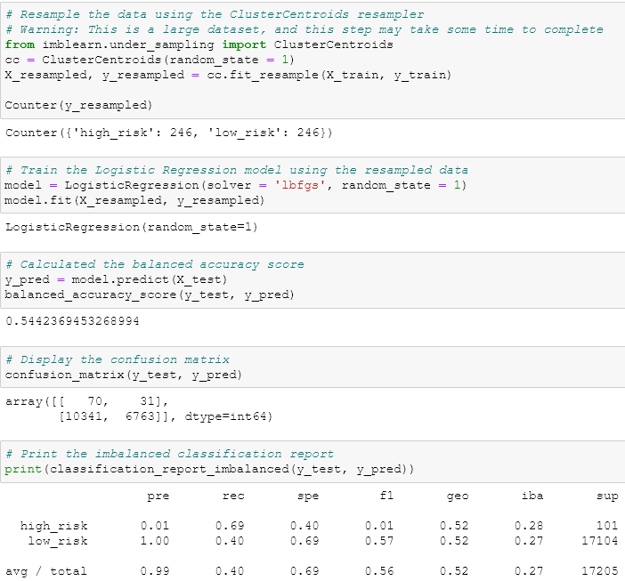

# Credit Risk Analysis

## Project Overview
Jill would like to know which of the machine learning models would be best to use for predicting credit risk.

1. Oversample data using RandomOverSampler and SMOTE, undersample using ClusterCentroids, and use a combinatorial approach of over- and undersampling with SMOTEENN.
2. Use Balanced Random Forest Classifier and Easy Ensemble Classifier that reduces bias.

## Resources
- Data Sources: [Resources](Resources.zip)
- Software: Jupyter Notebook

## Results
### Naive Random Oversampling

- The balanced accuracy score is 65%.
- The high-risk precision score is 1% and the recall score is 71%.
- The low-risk precision score is 100% and the recall score is 58%.
- The average precision score is 99% and the recall score is 58%.

### SMOTE Oversampling

- The balanced accuracy score is 66%.
- The high-risk precision score is 1% and the recall score is 63%.
- The low-risk precision score is 100% and the recall score is 68%.
- The average precision score is 99% and the recall score is 68%.

### Cluster Centroids

- The balanced accuracy score is 54%.
- The high-risk precision score is 1% and the recall score is 69%.
- The low-risk precision score is 100% and the recall score is 40%.
- The average precision score is 99% and the recall score is 40%.

### SMOTEEN

- The balanced accuracy score is 65%.
- The high-risk precision score is 1% and the recall score is 72%.
- The low-risk precision score is 100% and the recall score is 57%.
- The average precision score is 99% and the recall score is 57%.

### Balanced Random Forest Classifier

- The balanced accuracy score is 77%.
- The high-risk precision score is 3% and the recall score is 67%.
- The low-risk precision score is 100% and the recall score is 87%.
- The average precision score is 99% and the recall score is 87%.

### Easy Ensemble AdaBoost Classifier

- The balanced accuracy score is 93%.
- The high-risk precision score is 9% and the recall score is 92%.
- The low-risk precision score is 100% and the recall score is 94%.
- The average precision score is 99% and the recall score is 94%.

## Summary
The Balanced Random Forest and Easy Ensemble AdaBoost Classifier had the highest balanced accuracy scores of the six machine learning models with respective scores of 77% and 93%. I would recommend using the Easy Ensemble AdaBoost Classifier due to its balanced accuracy score of 93% and having an average recall score of 94%.
